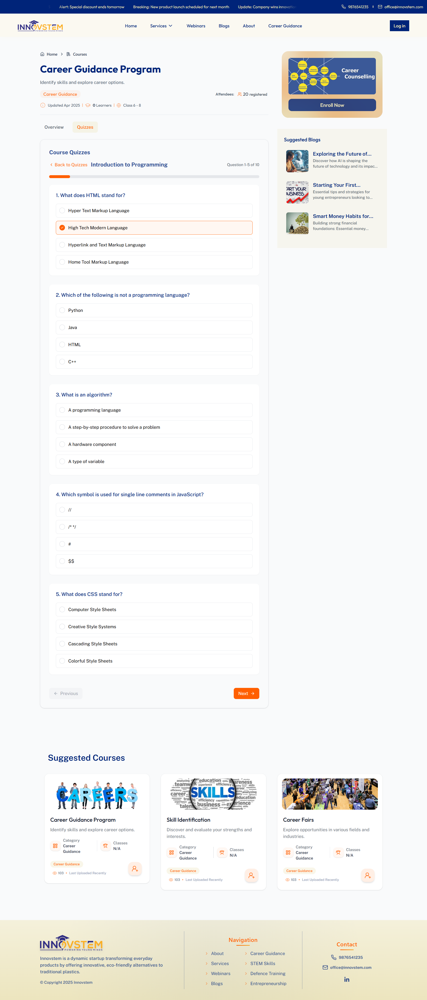

# InnovSTEM Frontend

A comprehensive edu-tech platform dedicated to nurturing the next generation of thinkers and leaders. InnovSTEM offers interactive STEM education, skills training, and development resources tailored specifically for school students.

🌐 Live Site: [https://dev.innovstem.com](https://dev.innovstem.com)

---

## Demo

---

## 🚀 About the Project

InnovSTEM is designed to empower young learners with the tools and guidance needed to excel in STEM fields and beyond. The platform delivers dynamic educational content and assessments to support continuous learning and development.

---

### 🎯 Key Features

- **Interactive STEM Courses**: Engaging lessons to spark curiosity in Science, Technology, Engineering, and Mathematics.
- **Skill Assessment Quizzes**: Evaluate knowledge and track learning progress.
- **Training Resources**: Access to curated materials supporting growth in academic and soft skills.

---

### 👨‍🎓 Target Audience

- Primary users: **School Students**

---

## 🛠️ Tech Stack

- **Frontend Framework**: React.js
- **State Management**: Zustand, React Query
- **Animations**: Framer Motion
- **Styling**: Tailwind CSS

---
